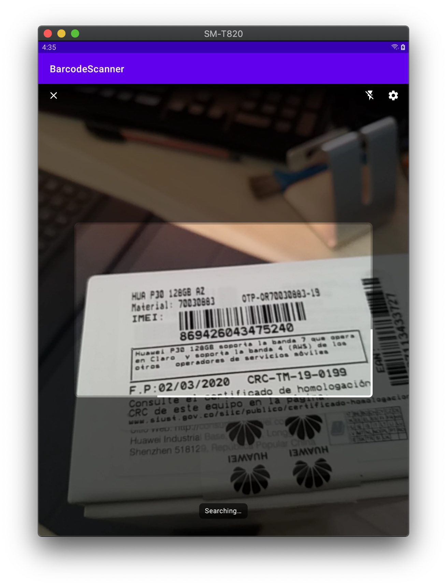
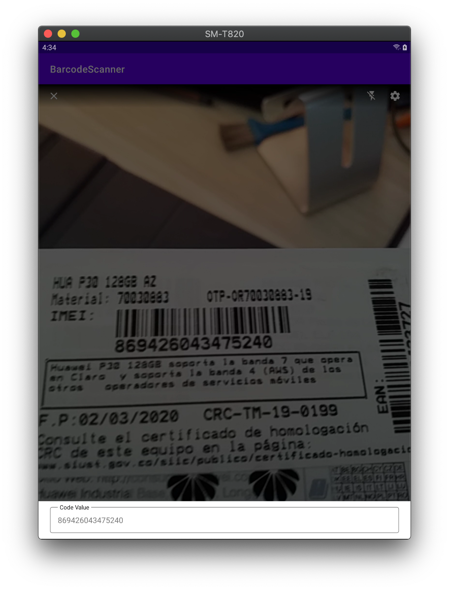
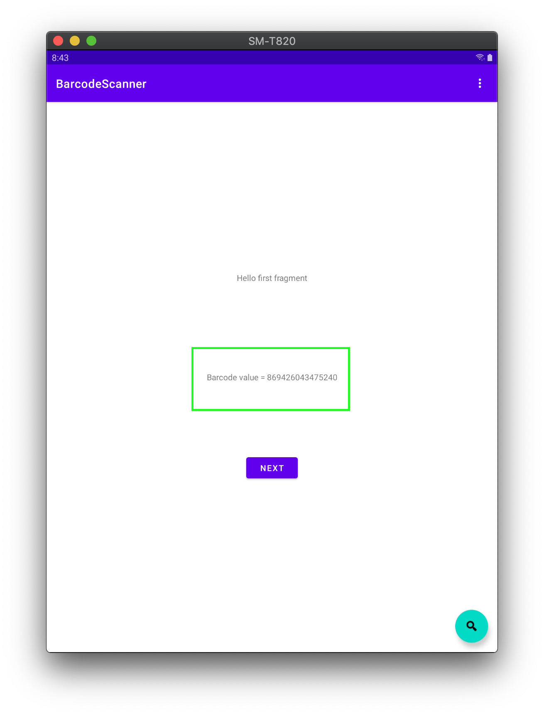

<!--
*** Thanks for checking out the Best-README-Template. If you have a suggestion
*** that would make this better, please fork the repo and create a pull request
*** or simply open an issue with the tag "enhancement".
*** Thanks again! Now go create something AMAZING! :D
***
***
***
*** To avoid retyping too much info. Do a search and replace for the following:
*** github_username, repo_name, twitter_handle, email, project_title, project_description
-->


<!-- PROJECT SHIELDS -->
<!--
*** I'm using markdown "reference style" links for readability.
*** Reference links are enclosed in brackets [ ] instead of parentheses ( ).
*** See the bottom of this document for the declaration of the reference variables
*** for contributors-url, forks-url, etc. This is an optional, concise syntax you may use.
*** https://www.markdownguide.org/basic-syntax/#reference-style-links
-->
[![Contributors][contributors-shield]][contributors-url]
[![Forks][forks-shield]][forks-url]
[![Stargazers][stars-shield]][stars-url]
[![Issues][issues-shield]][issues-url]
[![MIT License][license-shield]][license-url]
[![LinkedIn][linkedin-shield]][linkedin-url]

<!-- PROJECT LOGO -->
<br />
<p align="center">
  <a href="https://github.com/jyodroid/livebarcodescan">
    
  </a>

  <h3 align="center">livebarcodescan</h3>

  <p align="center">
    Adapt ML Showcase livebarcode scan to use in other projects
    <br />
    <a href="https://developers.google.com/ml-kit"><strong>Explore the ML Kit docs »</strong></a>
    <br />
    <br />
    <a href="https://github.com/googlesamples/mlkit/tree/master/android/material-showcase">View Material Showcase</a>
    ·
    <a href="https://github.com/jyodroid/livebarcodescan/issues">Report Bug / Request Feature</a>
  </p>
</p>


<!-- TABLE OF CONTENTS -->
<details open="open">
  <summary><h2 style="display: inline-block">Table of Contents</h2></summary>
  <ol>
    <li>
      <a href="#about-the-project">About The Project</a>
    </li>
    <li>
      <a href="#getting-started">Getting Started</a>
      <ul>
        <li><a href="#prerequisites">Prerequisites</a></li>
        <li><a href="#installation">Installation</a></li>
      </ul>
    </li>
    <li><a href="#usage">Usage</a></li>
    <li><a href="#roadmap">Roadmap</a></li>
    <li><a href="#contributing">Contributing</a></li>
    <li><a href="#license">License</a></li>
    <li><a href="#contact">Contact</a></li>
    <li><a href="#acknowledgements">Acknowledgements</a></li>
  </ol>
</details>

<!-- ABOUT THE PROJECT -->
## About The Project





I just needed to use the livebarcodescan from [Material Showcase](https://github.com/googlesamples/mlkit/tree/master/android/material-showcase) of ML Kit Examples in Android. In this project we use Activity result to use in any another activity the scanned barcode


<!-- GETTING STARTED -->
## Getting Started
To get a local copy up and running follow these simple steps.

### Prerequisites
Android Studio

### Installation

1. Include Jitpack repository on project level `build.gradle`
   ```
   allprojects {
    repositories {
        ...
        maven { url "https://jitpack.io" }
        ...
    }
   } 
   ```

2. Include the dependency on app level build.gradle
   ```gradle
      implementation 'com.github.jyodroid:livebarcodescan:0.0.1'
   ```

3. Add Activities to manifest
```
    <activity
      android:name="com.jyodroid.livebarcodescan.LiveBarcodeScanningActivity"
      android:exported="false"
      android:screenOrientation="portrait"/>

  <activity
      android:name="com.jyodroid.livebarcodescan.settings.BarcodeSettingsActivity"
      android:exported="false"
      android:label="@string/settings_title"/>
```

4. Add Camera permission to manifest
```
    <uses-feature android:name="android.hardware.camera"/>
    <uses-permission android:name="android.permission.CAMERA"/>
```

<!-- USAGE EXAMPLES -->
## Usage
You can see the app on this repo to check a very simple example.

All you need is to ask for camera permission and call `LiveBarcodeScanningActivity` for results

- Launch an intent for result to `LiveBarcodeScanningActivity`
```kotlin
        findViewById<FloatingActionButton>(R.id.fab).setOnClickListener { view ->
            Snackbar.make(view, "Replace with your own action", Snackbar.LENGTH_LONG)
                .setAction("Action", null).show()
            if (Build.VERSION.SDK_INT >= Build.VERSION_CODES.M && !Settings.System.canWrite(this)) {
                this.requestPermissions(arrayOf(Manifest.permission.CAMERA), 3)
            } else {
                starScanForResult.launch(Intent(this, LiveBarcodeScanningActivity::class.java))
            }
        }
```

- Handle the activity result
```kotlin
    private val starScanForResult: ActivityResultLauncher<Intent> =
        registerForActivityResult(ActivityResultContracts.StartActivityForResult()) {
            if (it.resultCode == Activity.RESULT_OK) {
                val barcodeValue =
                    it.data?.getStringExtra(BarcodeResultFragment.BARCODE_VALUE_EXTRA)
                if (barcodeValue.isNullOrBlank()) {
                    Log.e(TAG, "onScanResults result empty or null")
                    onErrorDialog?.apply {
                        setMessage("No barcode found")
                        show()
                    }
                } else {
                    Log.d(TAG, "barcode found = $barcodeValue")
                    barcodeText?.text = "Barcode value = $barcodeValue"
                }
            }
        }
```

<!-- ROADMAP -->
<!-- ## Roadmap

See the [open issues](https://github.com/github_username/repo_name/issues) for a list of proposed features (and known issues). -->


<!-- CONTRIBUTING -->
## Contributing

Contributions are what make the open source community such an amazing place to be learn, inspire, and create. Any contributions you make are **greatly appreciated**.

1. Fork the Project
2. Create your Feature Branch (`git checkout -b feature/AmazingFeature`)
3. Commit your Changes (`git commit -m 'Add some AmazingFeature'`)
4. Push to the Branch (`git push origin feature/AmazingFeature`)
5. Open a Pull Request

Take a look on [this gist](https://gist.github.com/MarcDiethelm/7303312) for more details

<!-- LICENSE -->
## License

Distributed under the MIT License. See `LICENSE` for more information.

<!-- CONTACT -->
## Contact

John Tangarife - [@jyo_tw](https://twitter.com/jyo_tw)

Project Link: [https://github.com/jyodroid/livebarcodescan](https://github.com/jyodroid/livebarcodescan)

<!-- ACKNOWLEDGEMENTS
## Acknowledgements

* []()
* []()
* []() -->

<!-- MARKDOWN LINKS & IMAGES -->
<!-- https://www.markdownguide.org/basic-syntax/#reference-style-links -->
[contributors-shield]: https://img.shields.io/github/contributors/jyodroid/livebarcodescan.svg?style=for-the-badge
[contributors-url]: https://github.com/jyodroid/livebarcodescan/graphs/contributors
[forks-shield]: https://img.shields.io/github/forks/jyodroid/livebarcodescan.svg?style=for-the-badge
[forks-url]: https://github.com/jyodroid/livebarcodescan/network/members
[stars-shield]: https://img.shields.io/github/stars/jyodroid/livebarcodescan.svg?style=for-the-badge
[stars-url]: https://github.com/github_username/livebarcodescan/stargazers
[issues-shield]: https://img.shields.io/github/issues/jyodroid/livebarcodescan.svg?style=for-the-badge
[issues-url]: https://github.com/github_username/livebarcodescan/issues
[license-shield]: https://img.shields.io/github/license/jyodroid/livebarcodescan.svg?style=for-the-badge
[license-url]: https://github.com/jyodroid/livebarcodescan/blob/master/LICENSE
[linkedin-shield]: https://img.shields.io/badge/-LinkedIn-black.svg?style=for-the-badge&logo=linkedin&colorB=555
[linkedin-url]: https://co.linkedin.com/in/john-tangarife-31aba070
